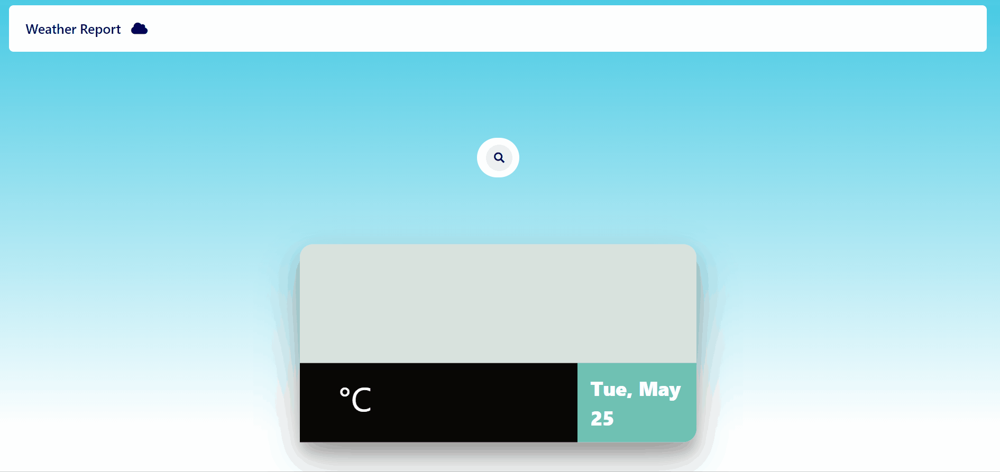

# Weather-WEB
This is a local website which displays the weather details of a given place :cloud::sunny:

This project includes the concepts of NODE :leaves: so it can be easily deployed using **HEROKU** :rocket:

It can be deployed both locally and on heroku by setting the port to

`const PORT = process.env.PORT || 3000`

Link to the website deployed on heroku
**https://weatherreportjs.herokuapp.com/**

## Initiation

The installation of express and body-parser are needed

`npm i express body-parser ejs`

In the app.js file do not forget to add the code as shown

`app.set('view engine', 'ejs');`

`app.use(bodyParser.urlencoded({extended: true}));`

## API

For the weather updates we need to use an API. In this case I used API from **OPEN WEATHER MAP** :snowman: *(it is most commonly used)*

`const url = 'https://api.openweathermap.org/data/2.5/weather?q='+ query +'&appid=XXXX&units=metric';`

where XXX can be replace by the api you use and the query is the cityname which can be parsed from the weather data you aquire

## Output

The website can be created by rendering ejs and css files. :computer:

*NOTE : CSS file cannot be rendered directly we need to use the following command in the app.js file*

`app.use(express.static("public"));`

public is the folder where css is located

Once when we run the app.js file `node app.js` go to 

> localhost:3000 

we get the following output :zap: :zap:

